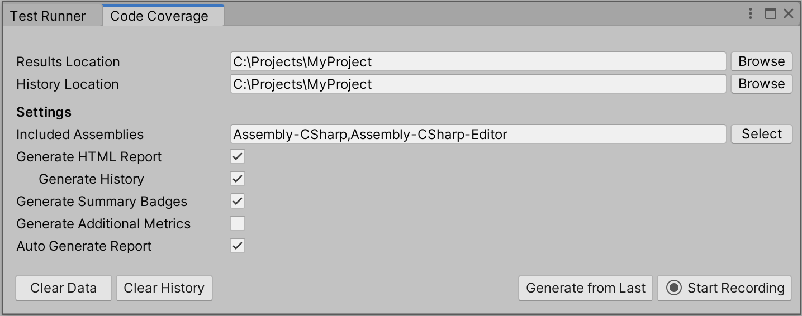

# Code Coverage window

|**Property**|**Description**|
|:---|:---|
|Destination|Select the **Browse** button to specify the folder where the coverage results and report will be saved to. The default destination is the Project's folder.|
|**Settings**|
|Included Assemblies|Specifies the assemblies to be included in the coverage results. This is a comma separated string. Select the **Select** button to view and select or deselect the assemblies.|
|Cyclomatic Complexity|Check this to enable the Cyclomatic Complexity calculation for each method. See the [Risk Hotspots](HowToInterpretResults.md#risk-hotspots) section for more information about Cyclomatic Complexity.|
|Generate HTML Report|Check this to include an HTML version of the report when the report is generated.|
|Generate Summary Badge|Check this to include a coverage summary badge when the report is generated.|
|Auto Generate Report|Check this to generate the report automatically after the [Test Runner](CoverageTestRunner.md) finishes running or the [Coverage Recording](CoverageRecording.md) is complete.|
|Clear Data|Select the **Clear Data** button to clear the coverage data from previous test runs for both _EditMode_ and _PlayMode_ tests or from previous [Coverage Recording](CoverageRecording.md) sessions, for the current project. The **Clear Data** button is disabled if the coverage data is cleared, if no tests run, or if there is no Coverage Recording data.|
|Clear History|Select the **Clear History** button to clear the Coverage Report history. The **Clear History** button is disabled if the history is cleared or if no reports were generated.|
|Generate from Last|Select the **Generate from Last** button to generate a Coverage Report from the last set of tests that were run in the [Test Runner](CoverageTestRunner.md) or from the last [Coverage Recording](CoverageRecording.md) session. Note that the **Generate from Last** button is disabled if no tests run, there is no Coverage Recording data or both **Generate HTML Report** and **Generate Summary Badge** are unchecked.|
|Start Recording|Select the **Start Recording** button to start [recording](CoverageRecording.md) coverage data.|
|Stop Recording|Select the **Stop Recording** button to stop [recording](CoverageRecording.md) coverage data.|