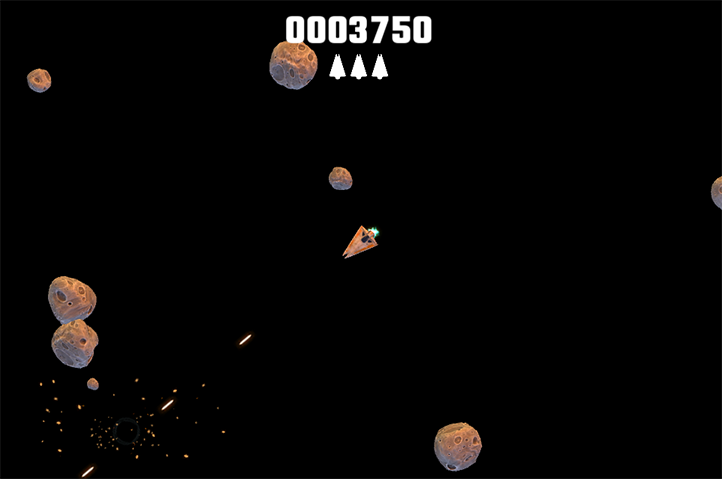
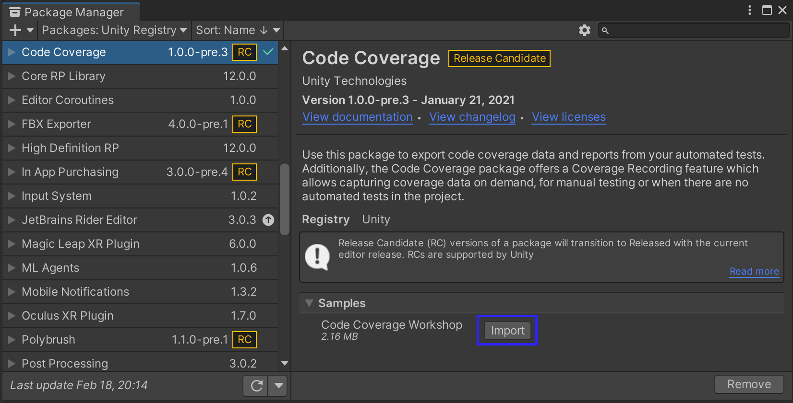
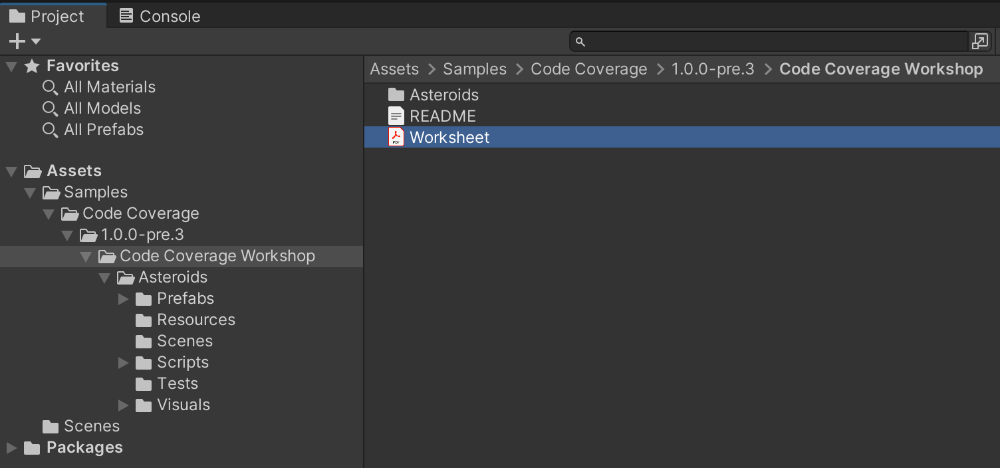

# Code Coverage Workshop

The Code Coverage Workshop will give you an insight into what Code Coverage is and how you can identify areas of your code that need more testing, even if you haven't written any automated tests. It takes about 30 minutes to complete.

## Steps

1. Install the Code Coverage package (see [Installing Code Coverage](InstallingCodeCoverage.md)).

2. While in the **Package Manager** (*Window* > *Package Manager*), select the **Code Coverage** package in the package list (left hand side) or enter **Code Coverage** in the search box.

3. Find the **Samples** section in the package details (right hand side) and select **Import** next to *Code Coverage Workshop*.  

4. Open the **Worksheet** pdf file located under the *Code Coverage Workshop* folder, and work through the tasks.  

### Workshop tasks

- What is Code Coverage
- Install the Code Coverage package
- Enable Code Coverage
- Understanding the game code: Shoot() function​
- Generate a Coverage report from the PlayMode tests​
- Add Weapon tests to improve coverage​
- Add a test for the LaserController​
- Clear the coverage data​
- Generate a Coverage report using Coverage Recording​
