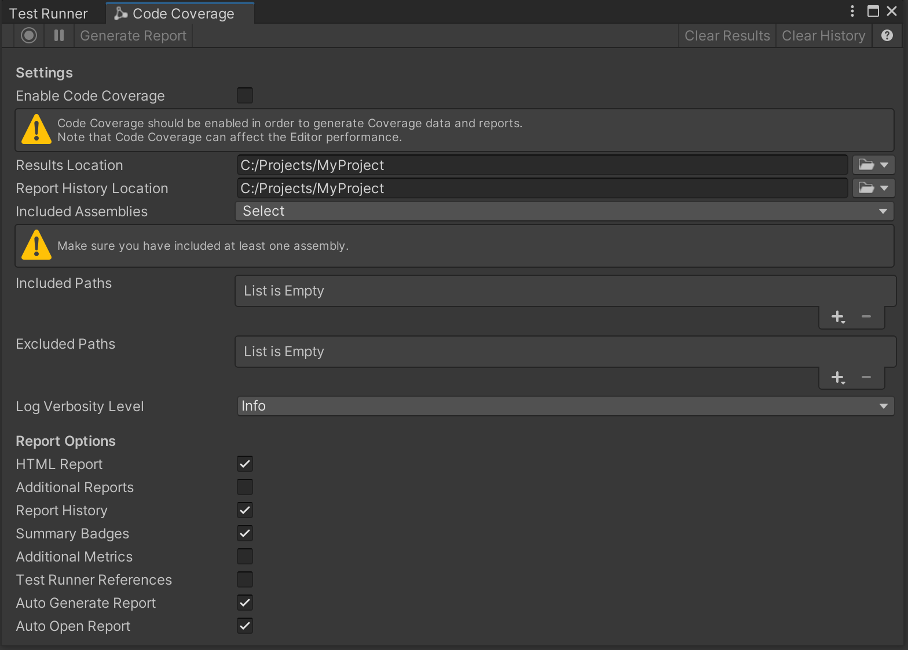
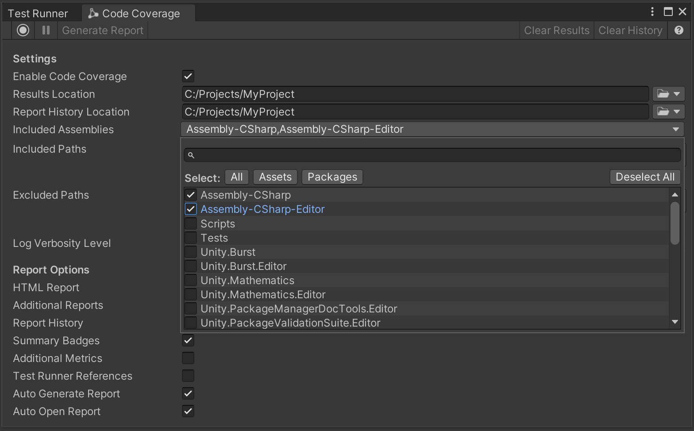
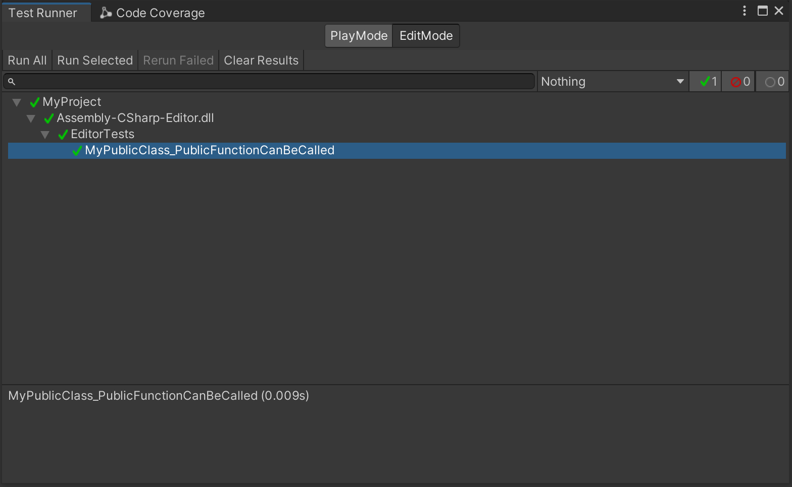
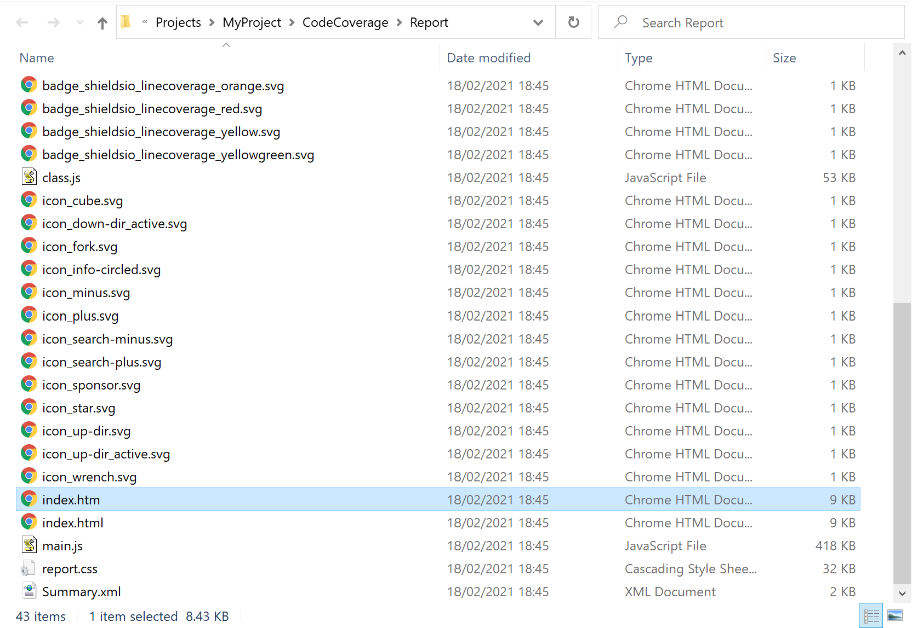

# Using Code Coverage with Test Runner

When running your tests in the [Test Runner](https://docs.unity3d.com/Packages/com.unity.test-framework@latest/index.html?subfolder=/manual/workflow-run-test.html) you can generate an HTML report which shows which lines of your code the tests cover. This includes both _EditMode_ and _PlayMode_ tests.

If **Auto Generate Report** is checked then an [HTML report](HowToInterpretResults.md) will be generated and a file viewer window will open up containing the coverage results and the report. Otherwise, select the **Generate from Last** button to generate one. The results are based on the assemblies specified in **Included Assemblies**.

## Steps

1. Open the [Code Coverage window](CodeCoverageWindow.md) (go to **Window** > **Analysis** > **Code Coverage**).<br/><br/>


2. Select **Enable Code Coverage** if not already selected, to be able to generate Coverage data and reports.<br/><br/>


3. Select the [Assembly Definitions](https://docs.unity3d.com/Manual/ScriptCompilationAssemblyDefinitionFiles.html) you would like to see the coverage for. In this example we selected `Assembly-CSharp` and `Assembly-CSharp-Editor`. By default, Unity compiles almost all project scripts into the `Assembly-CSharp.dll` managed assembly and all editor scripts into the `Assembly-CSharp-Editor.dll` managed assembly.<br/><br/>


4. Switch to the [Test Runner](https://docs.unity3d.com/Packages/com.unity.test-framework@latest/index.html?subfolder=/manual/workflow-run-test.html) and run your _EditMode_ or _PlayMode_ test(s).<br/><br/>


  Example test:
  ```
  using NUnit.Framework;
  using Assert = UnityEngine.Assertions.Assert;

  public class EditorTests
  {
     [Test]
     public void MyPublicClass_PublicFunctionCanBeCalled()
     {
         MyPublicClass myPublicClass = new MyPublicClass();
         Assert.IsTrue(myPublicClass.MyPublicFunction());
     }   
  }
  ```

5. When the test(s) finish running, a file viewer window will open up containing the coverage report.<br/>**Note:** To generate the report automatically after the Test Runner has finished running the tests you should have **Auto Generate Report** checked in the [Code Coverage window](CodeCoverageWindow.md). Alternatively, you can select the **Generate from Last** button.<br/>

6. Select `index.htm`.<br/><br/>


7. This opens the [HTML coverage report](HowToInterpretResults.md).<br/><br/>

<br/>

## Getting results for EditMode and PlayMode tests

Coverage data are generated from the last set of tests that were run in the [Test Runner](https://docs.unity3d.com/Packages/com.unity.test-framework@latest/index.html?subfolder=/manual/workflow-run-test.html).<br/><br/>
**Note:** Currently the Test Runner does not support _EditMode_ and _PlayMode_ tests running at the same time. To include coverage for both _EditMode_ and _PlayMode_ tests, these will need to run separately. In this case, the last Coverage Report generated will include the combined coverage of _EditMode_ and _PlayMode_ tests.

If a fresh start is required, select the **Clear Data** button to clear the Coverage data from all previous test runs for both _EditMode_ and _PlayMode_ tests.