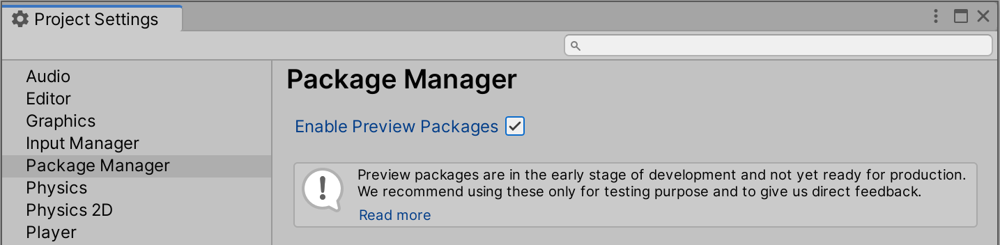
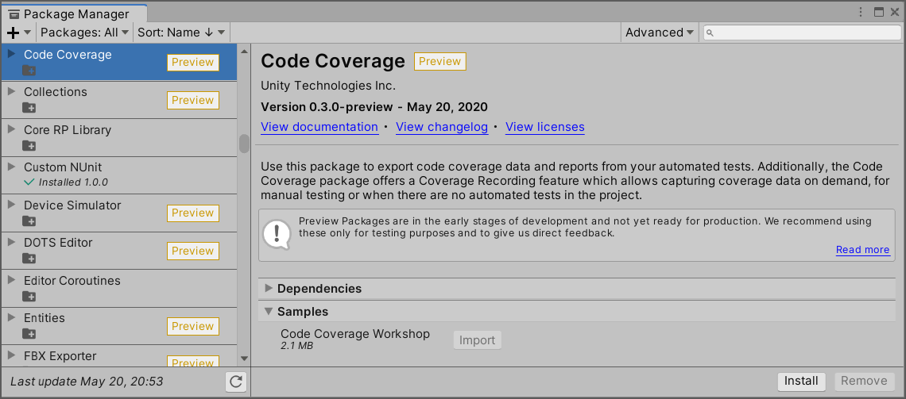

# Installing Code Coverage

Before you begin the following procedure, make sure you have no errors in the [Console](https://docs.unity3d.com/Manual/Console.html) window (in red text).

## Unity 2020.1 and later versions

1. Go to **Edit** > **Project Settings** > **Package Manager**, check **Enable Preview Packages** and confirm.  

2. Open the Package Manager (go to **Window** > **Package Manager**).

3. Make sure **Packages: Unity Registry** is selected.

4. Find the **Code Coverage** package in the package list (left hand side) or enter **Code Coverage** in the search box.

5. Select the **Code Coverage** package in the package list (left hand side), then select the **Install** button in the package details (right hand side).  

6. To verify that Code Coverage has been installed correctly, open the Code Coverage window (go to **Window** > **Analysis** > **Code Coverage**).

  If you don't see the **Code Coverage** menu item, then Code Coverage did not install correctly.

## Unity 2019.3 and Unity 2019.4

1. Open the Package Manager (go to **Window** > **Package Manager**).

2. Enable the **Show preview packages** option to see the Code Coverage package in the package list.  
Make sure **Unity Registry** is selected (**All packages** in Unity 2019.3).  

3. Find the **Code Coverage** package in the package list (left hand side) or enter **Code Coverage** in the search box.

4. Select the **Code Coverage** package in the package list (left hand side), then select the **Install** button in the package details (right hand side).  

5. To verify that Code Coverage has been installed correctly, open the Code Coverage window (go to **Window** > **Analysis** > **Code Coverage**).

  If you don't see the **Code Coverage** menu item, then Code Coverage did not install correctly.