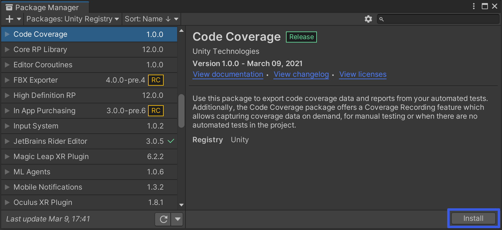

# Installing Code Coverage

Before you begin the following procedure, make sure you have no errors in the [Console](https://docs.unity3d.com/Manual/Console.html) window (in red text).

To install this package:

1. Open the Package Manager (go to **Window** > **Package Manager**).

2. Make sure you enable the **Show Preview Packages** option to see the Code Coverage package in the package list.  

3. Find the **Code Coverage** package in the package list (left hand side) or enter **Code Coverage** in the search box.

4. Select the **Code Coverage** package in the package list (left hand side), then select the **Install** button in the package details (right hand side).  

5. To verify that Code Coverage has been installed correctly, open the Code Coverage window (go to **Window** > **General** > **Code Coverage**).

  If you don't see the **Code Coverage** menu item, then Code Coverage did not install correctly.