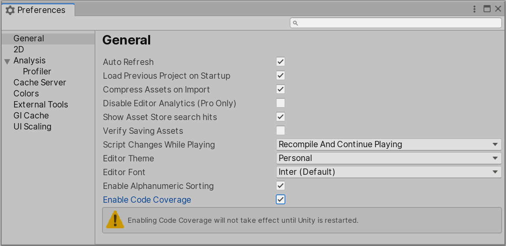

# Using Code Coverage

## Enable Code Coverage

1. Go to **Edit** > **Preferences** > **General** and check **Enable Code Coverage**.<br/><br/>


    This will enable access to the interface for the code coverage data that Mono exposes. For more information, see the documentation on [Coverage API](https://docs.unity3d.com/ScriptReference/TestTools.Coverage.html). Enabling Code Coverage adds some overhead to the editor and lowers the performance, so it is not recommended to leave it on if you are not performing coverage testing.

2. Restart Unity.

## Using Code Coverage in batchmode

There are 3 arguments that can be passed in batchmode:

**-enableCodeCoverage**, to enable code coverage.  
**-coverageResultsPath** (_optional_), to set the location where the coverage results and report will be saved to. The default location is the project's path.  
**-coverageOptions** (_optional_), to pass extra options. This is semicolon separated.   

|Coverage Option|Description|
|:---|:---|
|`enableCyclomaticComplexity`|Add this to enable the Cyclomatic Complexity calculation for each method. See the [Risk Hotspots](#risk-hotspots) section for more information about Cyclomatic Complexity.|
|`generateHtmlReport`|Add this to generate a coverage HTML report.|
|`generateBadgeReport`|Add this to generate a coverage summary badge.|
|`assemblyFilters`|Add this to specify the assemblies that should be included or excluded in the coverage calculation and/or report. This is a comma separated string. Prefix assemblies with `+` to include them and with `-` to exclude them. Globbing can be used to filter the assemblies.<br/><br/>**Examples:**<br/><br/>`assemblyFilters:+my.assembly` will only include code from the assembly called _my.assembly_ <br/>`assemblyFilters:+unity.*` will include code from any assembly whose name starts with _unity._<br/>`assemblyFilters:-*unity*` will exclude code from all assemblies that contain the word _unity_ in their names<br/>`assemblyFilters:+my.assembly.*,-my.assembly.tests` will include code from any assembly whose name starts with _my.assembly._, but will explicitly exclude code from the assembly called _my.assembly.tests_<br/>`assemblyFilters:+my.locale.??` will only inlcude code from assemblies whose names match this format, e.g. _my.locale.en_, _my.locale.99_, etc<br/>`assemblyFilters:+my.assembly.[a-z][0-9]` will only inlcude code from assemblies whose names match this format, e.g. _my.assembly.a1_, _my.assembly.q7_, etc|
|`pathFilters`|Add this to specify the paths that should be included or excluded in the coverage calculation and/or report. This is a comma separated string. Prefix paths with `+` to include them and with `-` to exclude them. Globbing can be used to filter the paths.<br/><br/>**Examples:**<br/><br/>`pathFilters:+C:/MyProject/Assets/MyClass.cs` will only include the _MyClass.cs_ file<br/>`pathFilters:-C:/MyProject/Assets/AutoGenerated/*` will exclude all files under the _C:/MyProject/Assets/AutoGenerated_ folder<br/>`pathFilters:+*/Assets/Editor/*` will include just the files that have _/Assets/Editor/_ in their path<br/>`pathFilters:+C:/MyProject/Assets/**/MyClass.cs` will include any file named _MyClass.cs_ that is under the _C:/MyProject/Assets_ folder and any of its subfolders<br/>`pathFilters:+C:/MyProject/*,-*/Packages/*` will only include files under _C:/MyProject/_ folder and exclude all files under any _Packages_ folder<br/>`pathFilters:+*/MyGeneratedClass_??.cs` will include only files with filenames that match this format, i.e. _MyGeneratedClass_01.cs_, _MyGeneratedClass_AB.cs_, etc<br/>`pathFilters:+*/MyClass_[A-Z][0-9].cs` will include only files with filenames that match this format, i.e. _MyClass_A1.cs_, _MyClass_Q7.cs_, etc|

### Example

```
Unity.exe -projectPath <path-to-project> -batchmode -testPlatform editmode -runTests -testResults
<path-to-results-xml> -debugCodeOptimization -enableCodeCoverage -coverageResultsPath <path-to-coverage-results>
-coverageOptions enableCyclomaticComplexity;generateHtmlReport;generateBadgeReport;
assemblyFilters:+my.assembly.*,-UnityEditor*;pathFilters:-*Packages*
```
The example above will open the project at _\<path-to-project\>_, run the _EditMode_ tests and produce an HTML coverage report and Badge in _\<path-to-coverage-results\>_. The report will include code from any assembly whose name starts with _my.assembly._, will explicitly exclude code from any assembly whose name starts with _UnityEditor_ and will exclude files that have _Packages_ in their path (i.e. all the packages under the Packages folder).

**Note:** `-debugCodeOptimization` is passed above to ensure Code optimization is set to Debug mode. See [Using Code Coverage with Code Optimization](#using-code-coverage-with-code-optimization)

### Generate combined report from EditMode and PlayMode tests

To get coverage information for both EditMode and PlayMode tests, run the editor three times as shown in the example below.
```
Unity.exe -projectPath <path-to-project> -batchmode -testPlatform editmode -runTests -debugCodeOptimization -enableCodeCoverage -coverageResultsPath <path-to-coverage-results>
-coverageOptions enableCyclomaticComplexity;assemblyFilters:+my.assembly.*

Unity.exe -projectPath <path-to-project> -batchmode -testPlatform playmode -runTests -debugCodeOptimization -enableCodeCoverage -coverageResultsPath <path-to-coverage-results>
-coverageOptions enableCyclomaticComplexity;assemblyFilters:+my.assembly.*

Unity.exe -projectPath <path-to-project> -batchmode -debugCodeOptimization -enableCodeCoverage -coverageResultsPath <path-to-coverage-results>
-coverageOptions generateHtmlReport;generateBadgeReport -quit
```
The first will generate the coverage results for the EditMode tests, the second will generate the coverage results for the PlayMode tests and the third will generate the coverage report and summary badge based on both coverage results.

## Using Code Coverage with Burst compiler

If you use the [Burst package](https://docs.unity3d.com/Packages/com.unity.burst@latest) and have jobs compiled with Burst, you will need to disable Burst compilation in order to get full coverage. To disable Burst compilation you can do **one** of the following:

- Uncheck **Enable Compilation** under **Jobs** > **Burst** > **Enable Compilation**
- Pass `-burst-disable-compilation` to the command line

## Using Code Coverage with Code Optimization

Code Optimization was introduced in 2020.1. Code Optimization mode defines whether Unity Editor compiles scripts in Debug or Release mode. Debug mode enables C# debugging and it is required in order to obtain accurate code coverage. To ensure Code optimization is set to Debug mode you can do **one** of the following:

- Switch to Debug mode in the Editor (bottom right corner, select the **Bug icon** > **Switch to debug mode**)
- Using the CompilationPipeline api, set `CompilationPipeline.codeOptimization = CodeOptimization.Debug`
- Pass `-debugCodeOptimization` to the command line