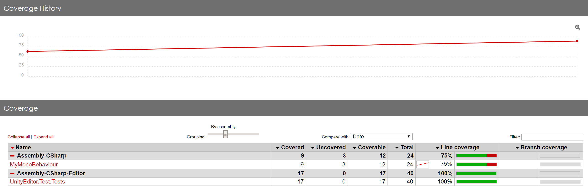
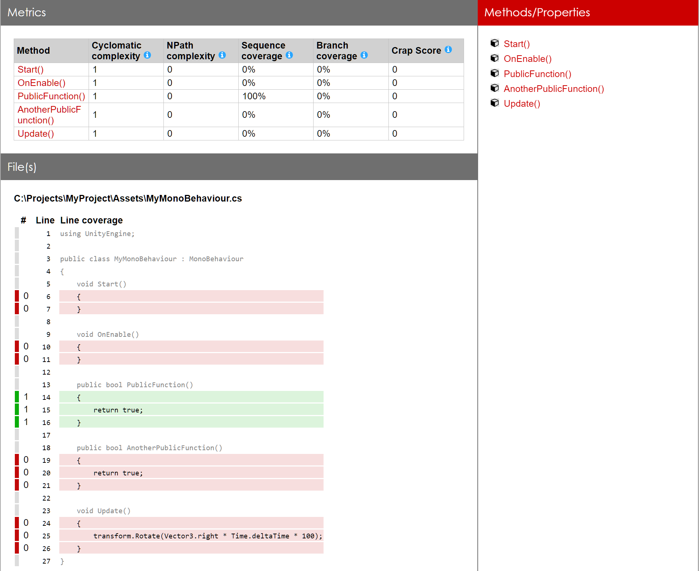

# About Code Coverage

Use the Code Coverage package with the [Test Runner](CoverageTestRunner.md) to gather and present test coverage information. When you run your tests with code coverage enabled you can see exactly which lines of your code are executed when the tests run in addition to whether the tests passed or failed. See [Using Code Coverage with Test Runner](CoverageTestRunner.md).

Once a test run has completed, the Code Coverage package will generate an [HTML coverage report](HowToInterpretResults.md) showing which lines of your code are covered by tests. Code Coverage currently supports **EditMode** and **PlayMode** tests. It also allows you to track the code coverage changes through time.

Additionally, the Code Coverage package offers a [Coverage Recording](CoverageRecording.md) feature which allows capturing coverage data on demand.

The Code Coverage package is available as a preview package via the Package Manager for Unity 2019.3 and above. See [Installing Code Coverage](InstallingCodeCoverage.md). Please make sure to enable preview packages in the Package Manager, otherwise it won't be listed.

## Coverage HTML Report

Shown below is an example of the top level page of a HTML report generated by the package.

### Class View

## Coverage Summary Badge

Additionally, the package can produce a simple badge showing the current percentage of code that is covered.

 

## Preview package
This package is available as a preview, so it is not ready for production use. The features and documentation in this package might change before it is verified for release.
