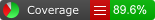

# About Code Coverage

[Code Coverage](https://en.wikipedia.org/wiki/Code_coverage) is a measure of how much of your code is executed when you run automated tests. It is typically presented as a report that shows the percentage of your code that is covered by tests.

It is much easier to accidentally introduce bugs into code that is not covered by tests, because those bugs are not detected straight away by the tests and can instead cause problems later — such as after you have published your game or app.

The report does not measure the quality of tests, only whether your code is executed at all by *EditMode* and *PlayMode* tests. It is especially useful to check that critical or high risk areas of your code are covered, because they should receive the most rigorous testing.

## Code Coverage package

Use the Code Coverage package with the [Test Runner](CoverageTestRunner.md) to gather and present test coverage information. When you run your tests with code coverage enabled you can see exactly which lines of your code are executed when the tests ran in addition to whether the tests passed or failed. See [Using Code Coverage with Test Runner](CoverageTestRunner.md).

Once a test run has completed, the Code Coverage package will generate an [HTML coverage report](HowToInterpretResults.md) showing which lines of your code are covered by tests. Code Coverage currently supports **EditMode** and **PlayMode** tests. It also allows you to track the code coverage changes through time.

Additionally, the Code Coverage package offers a [Coverage Recording](CoverageRecording.md) feature which allows capturing coverage data on demand, in case you do not have tests in your project.

The [Code Coverage Workshop](CodeCoverageWorkshop.md) will give you an insight into the package.

The Code Coverage package is available as a preview package via the Package Manager for Unity 2019.3 and above — see [Installing Code Coverage](InstallingCodeCoverage.md). Please make sure to enable preview packages, otherwise it won't be listed.

## Coverage HTML Report

Shown below is an example of the top level page of a HTML report generated by the package.

### Class View

This view shows some brief statistics for the selected class as well as the C# source code. Each line will be colored either green or red depending on whether the line was covered or not.

For more information see [How To Interpret Results](HowToInterpretResults.md).

## Coverage Summary Badges

Additionally, the package can produce simple badges in SVG and PNG format, showing the current percentage of code that is covered.

 

## Preview package
This package is available as a preview, so it is not ready for production use. The features and documentation in this package might change before it is verified for release.
